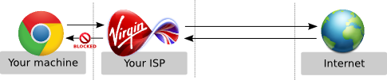
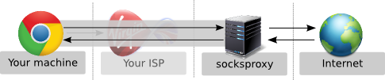

socksproxy
----------

sockproxy is a simple script to run a [SOCKS proxy](http://en.wikipedia.org/wiki/SOCKS) on your own server. It is merely a wrapper script to orchestrate `ssh` and `iptables` properly to make it easier in everyday use.

What is socksproxy?
-------------------
Much like a regular HTTP(S) proxy, a SOCKS proxy can be used to redirect/tunnel traffic through a certain server. This is useful if you want to circumvent country or content-based Internet filtering or access blocked content, e.g., by governments, workplaces, schools, and country-specific web services. Unlike HTTP(S) proxies, however, SOCKS operates on a lower level and can hence also used for other protocols (e.g. FTP, SMTP, ..).

**Without socksproxy**, the Internet is potentially blocked/filtered by the ISP:



**With socksproxy** (running on a machine without filtered access), all traffic is tunneled to through socksproxy and filters are circumvented:



Installation
------------
Dependencies are *openssh-server* and *iptables*, so be sure to have those installed.
On Debian-based systems: Either download a `.deb`-file from the [release page](https://github.com/binwiederhier/socksproxy/releases) or compile it yourself:
```bash
$ make
$ sudo dpkg -i build/*.deb
```

Manually:
```bash
$ sudo cp files/sbin/* /sbin
$ sudo cp files/etc/* /etc
```

Usage
-----
Edit the config file at `/etc/socksproxy.conf` and add the allowed IP addresses and (if you like) the port on which the proxy should run on:

```bash
# Sets the port on which the proxy can be accessed on.
proxyport=1080

# Defines the IP addresses allowed to use the proxy. 
allowedips=1.2.3.4 5.6.7.8
```

Then start the SOCKS proxy by running:

```bash
$ socksproxy start
Starting socksproxy on port 1080 ... Started with PID 15761.
```

You can now add it to your browser / operating system config and you are ready to surf via your proxy host!

